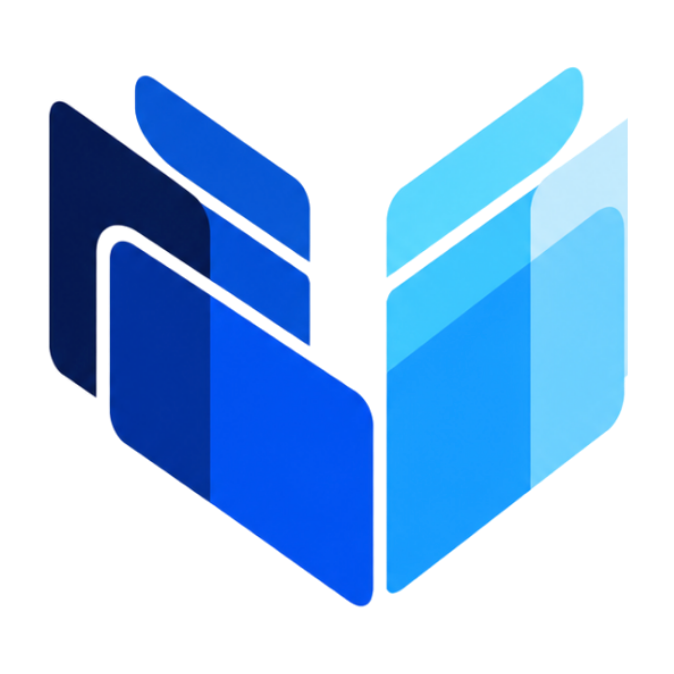
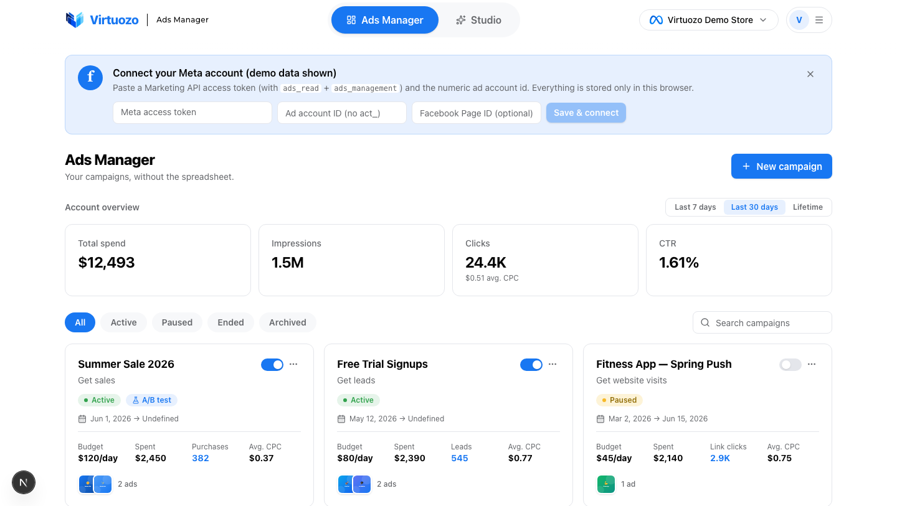
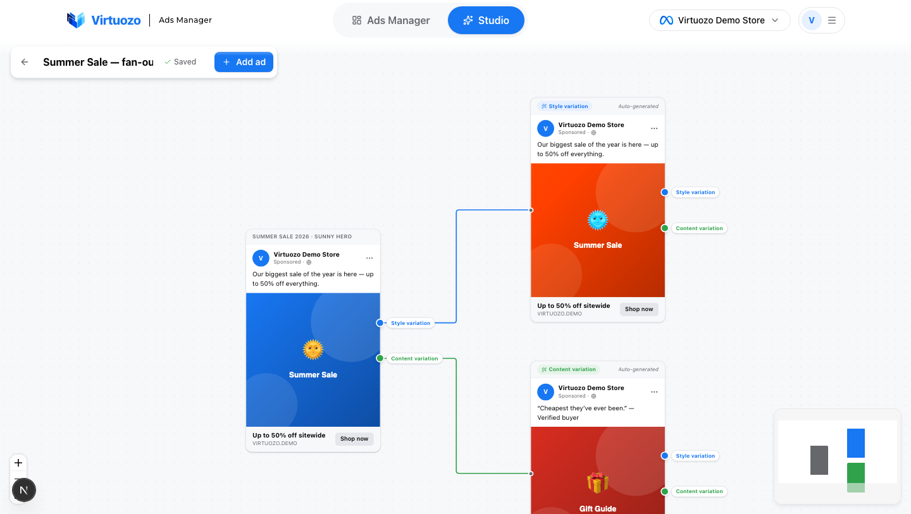
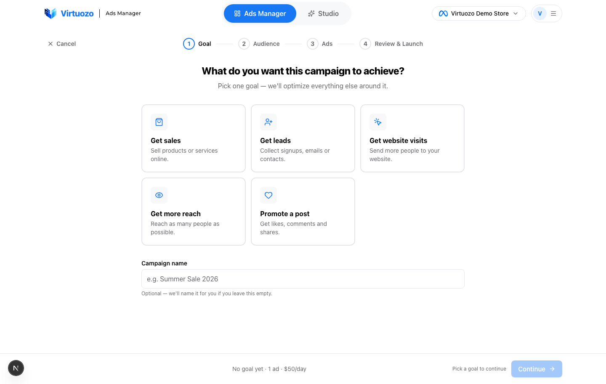
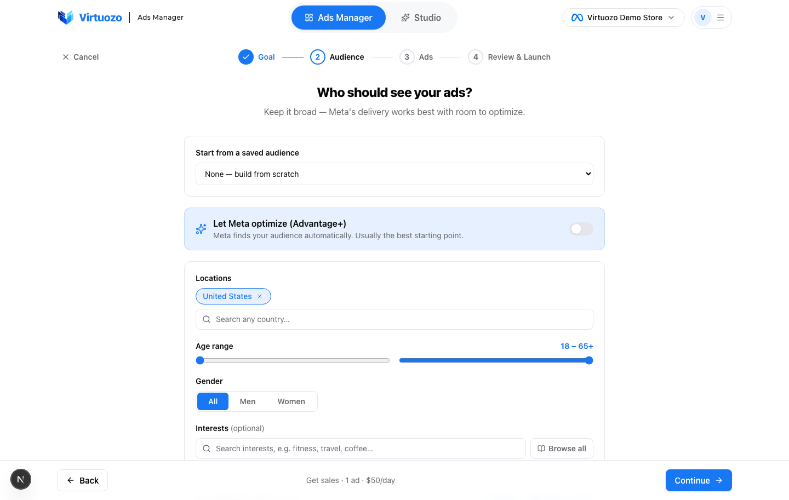
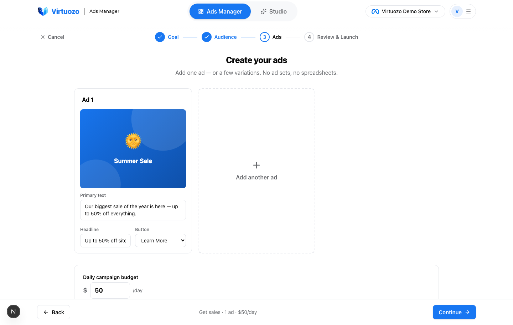
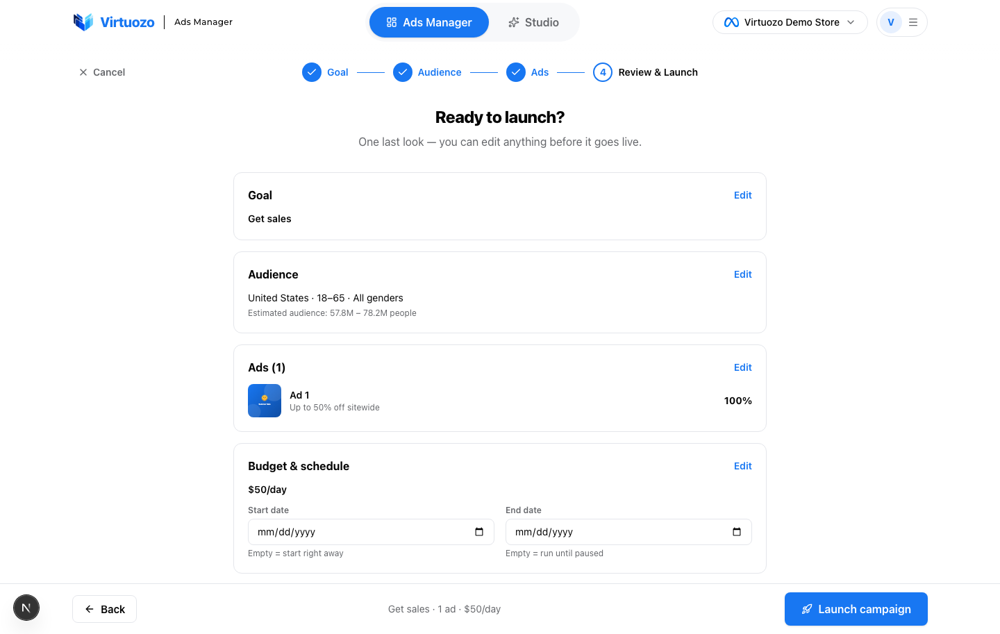
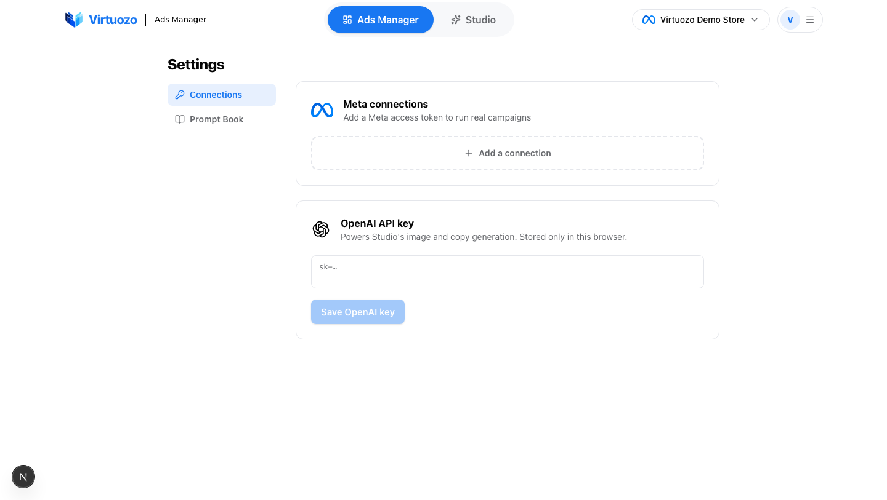

<div align="center">



# Virtuozo

<p>
  
  &nbsp;<b>Built by <a href="https://powerbrix.ai">PowerBrix</a></b>
</p>

### The source-available Meta ads manager with an infinite AI ad studio.

**Targeting isn't the problem. Your ads are.**
Andromeda already runs the targeting, bidding and delivery — you can't out-bid or out-target it, and it doesn't matter that you can't. The only lever left is the creative. Virtuozo is how you pull that lever: **generate as many ads as you need, feed them to Andromeda, and let it surface the winner.**

Runs entirely in your browser. No accounts, no database, no sign-up. Bring your own Meta token and OpenAI key.

</div>

<br />



<br />

## Why Virtuozo

Every advertiser fights the same losing game:

- **Every ad is a cash bet.** You build a creative, fund it, and hope Andromeda backs it. Most it quietly buries — and the budget is gone either way.
- **The winner is buried under losers.** One ad carries the whole account. The old way, you only find it after paying to run the dozen that don't.
- **You quit before it clicks.** One test at a time, a week per read. Money and patience run out long before the winning ad shows up.

Virtuozo flips it: **stop guessing which ad wins — make so many strong ads that Andromeda can't help but find one.**

<br />

## What's inside

### 🎨 Studio — an infinite canvas for your ads

Drop in your best ad and drag out variations, ten at a time. Two ways to vary, both powered by OpenAI:

- **Style variations** — same words, brand-new execution. Every quote, price and claim survives untouched; the layout, palette and type system are rebuilt.
- **Content variations** — same design system, brand-new message. A comparison, a review, an offer, a stat-led claim — a sibling in the same campaign family.

Variations are ads too. Pull from them again, and again. It never bottoms out.



### 📊 Ads Manager — your campaigns, minus the spreadsheet

Real Meta data, clean cards. See spend, impressions, clicks, CTR and CPC at a glance, toggle campaigns and ads on and off, rebalance budgets, and publish new campaigns straight from Studio. **Everything you publish starts paused — nothing spends until you say go.**


**Launching a campaign is four quick steps** — no ad sets, no spreadsheets:

<table>
  <tr>
    <td width="50%" valign="top"><b>1 · Pick a goal</b><br/></td>
    <td width="50%" valign="top"><b>2 · Choose your audience</b><br/></td>
  </tr>
  <tr>
    <td width="50%" valign="top"><b>3 · Build the ads</b><br/></td>
    <td width="50%" valign="top"><b>4 · Review &amp; launch</b><br/></td>
  </tr>
</table>

<br />

## Quick start

```bash
git clone https://github.com/automatewithmarko/virtuozo.git
cd virtuozo
npm install
npm run dev
```

Open **http://localhost:3000** and you're in — the Ads Manager loads with demo data so you can look around immediately.

### Add your keys

Everything is configured in the app (**Settings**, or the connect banner on the Ads Manager) and stored **only in your browser** — nothing is ever sent to a server we control.



**Meta** — paste a [Marketing API](https://developers.facebook.com/docs/marketing-apis/) access token (with `ads_read` + `ads_management`) and your numeric ad account id. A Graph API Explorer token works for a quick try; a Business Manager system-user token if you want one that doesn't expire.

**OpenAI** — paste an API key (`sk-…`) to turn on real generation in Studio. Without a key, Studio still runs with simulated variations so you can feel the flow.

<br />

## How it works

Virtuozo is a Next.js app with **no backend of its own**:

- **No database.** Your Meta connections, OpenAI key, Prompt Book overrides and every Studio canvas live in your browser's `localStorage`.
- **No auth, no accounts.** Nothing to sign up for. It's your machine.
- **Stateless API routes.** The bundled routes are thin proxies — your keys ride along in request headers and are used only to call Meta and OpenAI directly, then forgotten.

That means your credentials never leave your machine except to talk to Meta and OpenAI, and you can self-host it anywhere Next.js runs.

<br />

## Tech

- [Next.js 16](https://nextjs.org/) (App Router) + React 19 + TypeScript
- [Tailwind CSS v4](https://tailwindcss.com/)
- [React Flow](https://reactflow.dev/) for the Studio canvas
- The [Meta Marketing API](https://developers.facebook.com/docs/marketing-apis/) and the [OpenAI API](https://platform.openai.com/) (image + text) for generation

<br />

## Configuration (optional)

Virtuozo needs no `.env` file — but you can override a couple of install-wide defaults (see `.env.example`):

| Variable | Default | What it does |
| --- | --- | --- |
| `META_API_VERSION` | `v23.0` | Meta Graph API version |
| `OPENAI_IMAGE_MODEL` | `gpt-image-1` | Model used for image generation |
| `OPENAI_TEXT_MODEL` | `gpt-4o` | Model used for ad copy |

<br />

## License

Source-available under the [Virtuozo Source-Available License](LICENSE). You're free to **use, run, and modify** Virtuozo for your **own personal use** and your **organization's internal business operations** — run your own ads and your team's ads, all you like.

You may **not** redistribute, resell, sublicense, or use it (or anything derived from it) to build or operate a product or service for third parties, without a separate commercial license. See [LICENSE](LICENSE) for the full terms.

<br />

<div align="center">


&nbsp;<b>Built by <a href="https://powerbrix.ai">PowerBrix</a></b>

</div>
